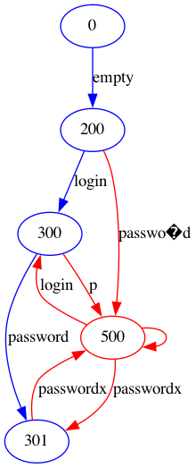

# New AFLNet version

This repo is a fork of the stateful Fuzzer [AFLNet](https://github.com/aflnet/aflnet), developed to cope efficiently with stateful systems.

# Upgrades

## Outputs a complete state model

This version of AFLNet allows the user to export the state model of the system by integrating the labels in the edges.

**The old graph:**

**The new graph:**

# Allows testing the fuzzer on custom code

AFLNet only supports known protocols. This version implements a **TEST** version that allows processing the *requests* and *responses* of custom software.

For example: 

    ./afl-fuzz -d -i ./input -o output -N tcp://127.0.0.1/port -P TEST -D 10000 -q 3 -s 3 -E -R ./my_program

allows to read from the input folder the messages to send to *my_program* and interprets the messages received from the program as *response codes*

# Licences

AFLNet is licensed under [Apache License, Version 2.0](https://www.apache.org/licenses/LICENSE-2.0).

AFLNet is an extension of [American Fuzzy Lop](http://lcamtuf.coredump.cx/afl/) written and maintained by Michał Zalewski <<lcamtuf@google.com>>. For details on American Fuzzy Lop, we refer to [README-AFL.md](README-AFL.md).

* **AFL**: [Copyright](https://github.com/aflsmart/aflsmart/blob/master/docs/README) 2013, 2014, 2015, 2016 Google Inc. All rights reserved. Released under terms and conditions of [Apache License, Version 2.0](https://www.apache.org/licenses/LICENSE-2.0).
